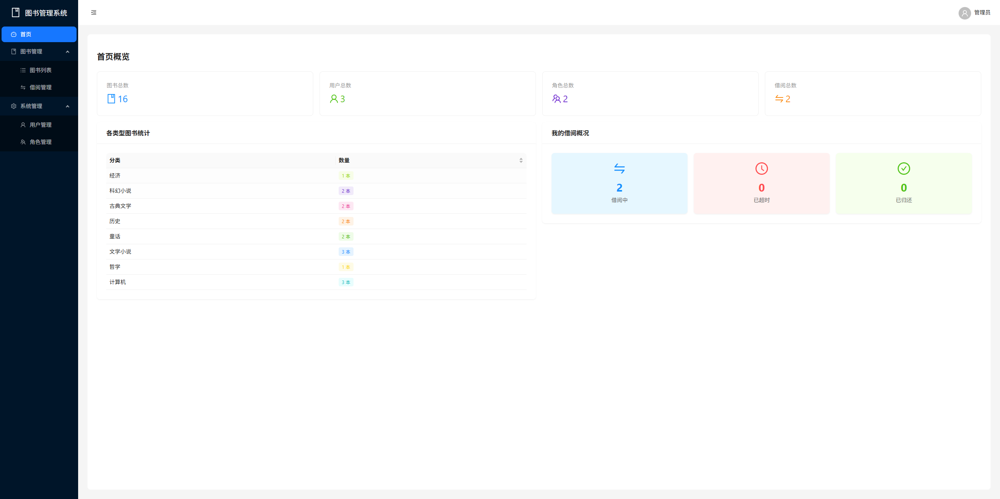
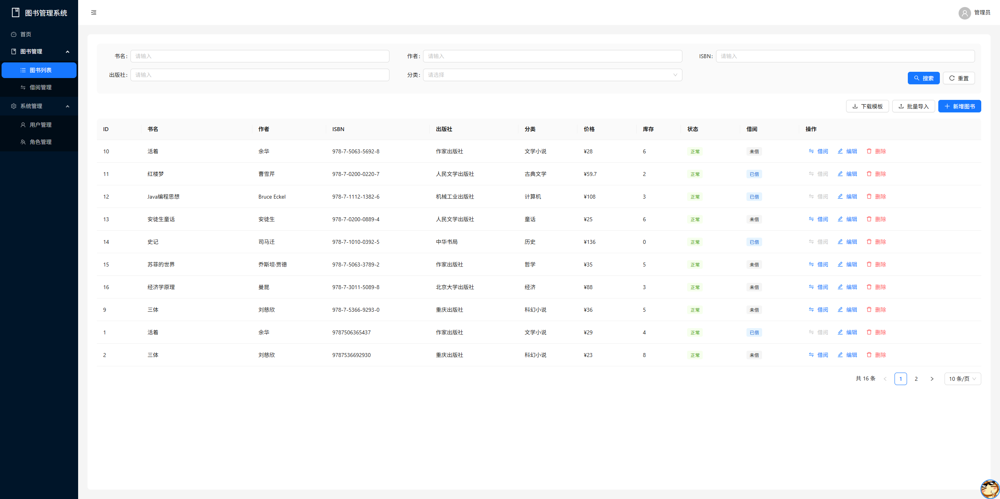
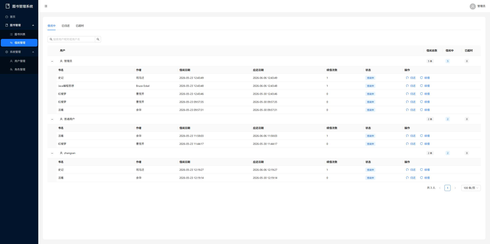
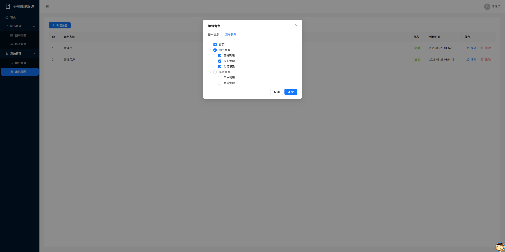

# Library Management System (图书管理系统)

基于 **Spring Boot + React** 的前后端分离图书管理系统，实现了图书管理、借阅归还、用户权限控制等核心功能。

## 系统截图

### 首页仪表盘


展示图书总数、用户数、借阅统计、分类分布等关键数据，提供直观的数据概览。

### 图书列表


支持图书的增删改查、多条件筛选（书名/作者/ISBN/出版社/分类）、批量 Excel 导入等功能。

### 借阅管理


按用户分组展示借阅记录，支持按状态（借阅中/已归还/已超时）筛选，可执行归还和续借操作。

### 角色权限控制


基于 RBAC 模型的角色管理，支持动态菜单分配和细粒度的权限控制。

## 技术栈

### 后端

| 技术 | 版本 | 说明 |
|------|------|------|
| Java | 1.8 | 开发语言 |
| Spring Boot | 2.7.18 | 应用框架 |
| Spring Security | - | 安全框架，实现 JWT 认证 |
| MyBatis Plus | 3.5.3.1 | ORM 框架 |
| MySQL | 8.0 | 关系型数据库 |
| Redis | - | 缓存（支持开关切换本地缓存） |
| JWT | 0.9.1 | 无状态认证 |
| Apache POI | 4.1.2 | Excel 文件解析 |
| Lombok | - | 简化代码 |

### 前端

| 技术 | 版本 | 说明 |
|------|------|------|
| React | 18.3.1 | UI 框架 |
| React Router | 6.30.3 | 路由管理 |
| Ant Design | 6.4.3 | UI 组件库 |
| Axios | 1.16.1 | HTTP 请求 |
| Vite | 5.4.10 | 构建工具 |

## 功能特性

### 用户认证
- JWT 无状态登录认证
- 用户注册（支持填写邮箱、手机号等信息）
- 个人信息查看与修改

### 权限管理 (RBAC)
- 用户管理：增删改查、搜索筛选、密码重置、状态启用/禁用
- 角色管理：角色 CRUD、菜单权限分配
- 动态菜单：根据用户角色动态加载侧边栏菜单
- 自动包含父级菜单

### 图书管理
- 图书信息 CRUD（书名、作者、ISBN、出版社、分类、价格、库存等）
- 多条件组合搜索（书名/作者/ISBN/出版社/分类）
- 批量 Excel 导入（支持 .xlsx 格式，提供模板下载）
- 图书状态管理（正常/下架）

### 借阅管理
- 图书借阅与归还
- 续借功能（记录续借次数）
- 借阅状态跟踪（借阅中/已归还/已超时）
- 按用户分组展示借阅情况
- 借阅记录独立查看

### 数据统计
- 首页仪表盘展示关键指标
- 图书分类统计图表
- 借阅概况数据

### 其他特性
- Redis 缓存支持（可通过配置开关切换为本地缓存）
- 统一 API 响应格式
- 请求/响应拦截器自动注入 Token
- 全局错误处理
- 页面组件懒加载

## 项目结构

```
Library Management System/
├── backend/                          # 后端项目
│   ├── src/main/java/com/library/
│   │   ├── config/                   # 配置类（Security、Redis、CORS 等）
│   │   ├── controller/               # 控制器层
│   │   ├── dto/                      # 数据传输对象
│   │   ├── entity/                   # 实体类
│   │   ├── mapper/                   # MyBatis Mapper 接口
│   │   ├── service/                  # 业务逻辑层
│   │   └── utils/                    # 工具类（JWT 等）
│   └── src/main/resources/
│       ├── mapper/                   # Mapper XML 文件
│       └── application.yml           # 应用配置
├── frontend/                         # 前端项目
│   ├── src/
│   │   ├── components/               # 公共组件（MainLayout 等）
│   │   ├── context/                  # React Context（AuthContext）
│   │   ├── pages/                    # 页面组件
│   │   │   ├── book/                 # 图书相关页面
│   │   │   └── system/               # 系统管理页面
│   │   ├── services/                 # API 请求封装
│   │   ├── App.jsx                   # 路由配置
│   │   └── main.jsx                  # 入口文件
│   └── vite.config.js               # Vite 配置
├── picture/                          # 项目截图
└── init_database.sql                 # 数据库初始化脚本
```

## 快速开始

### 环境要求

- JDK 1.8+
- Maven 3.6+
- Node.js 16+
- MySQL 8.0
- Redis（可选，可通过配置关闭）

### 数据库初始化

1. 创建数据库：

```sql
CREATE DATABASE library_db DEFAULT CHARACTER SET utf8mb4 COLLATE utf8mb4_general_ci;
```

2. 执行初始化脚本：

```bash
mysql -u root -p library_db < init_database.sql
```

### 后端启动

1. 修改数据库和 Redis 配置（`backend/src/main/resources/application.yml`）：

```yaml
spring:
  datasource:
    url: jdbc:mysql://localhost:3306/library_db?useUnicode=true&characterEncoding=utf-8&serverTimezone=Asia/Shanghai
    username: root
    password: 123456          # 修改为你的数据库密码
  redis:
    host: localhost
    port: 6379
    password: your_password   # 修改为你的 Redis 密码

app:
  cache:
    redis-enabled: true       # 设为 false 可使用本地缓存（无需 Redis）
```

2. 编译并启动：

```bash
cd backend
mvn clean package -DskipTests
java -jar target/library-management-1.0.0.jar
```

后端默认运行在 `http://localhost:8080/api`

### 前端启动

1. 安装依赖：

```bash
cd frontend
npm install
```

2. 启动开发服务器：

```bash
npm run dev
```

前端默认运行在 `http://localhost:5173`，API 请求会自动代理到后端。

3. 生产构建：

```bash
npm run build
```

## 默认账号

| 角色 | 用户名 | 密码 | 权限 |
|------|--------|------|------|
| 管理员 | admin | 123456 | 全部功能 |
| 普通用户 | user | 123456 | 图书浏览、借阅、个人信息 |

## API 接口

| 模块 | 接口 | 方法 | 说明 |
|------|------|------|------|
| 认证 | `/api/auth/login` | POST | 用户登录 |
| 认证 | `/api/auth/register` | POST | 用户注册 |
| 图书 | `/api/book/list` | GET | 图书列表（支持分页和多条件搜索） |
| 图书 | `/api/book` | POST/PUT | 新增/更新图书 |
| 图书 | `/api/book/{id}` | DELETE | 删除图书 |
| 图书 | `/api/book/borrow/{id}` | POST | 借阅图书 |
| 图书 | `/api/book/import` | POST | 批量导入图书 |
| 借阅 | `/api/borrow/list` | GET | 借阅记录列表 |
| 借阅 | `/api/borrow/return/{id}` | POST | 归还图书 |
| 借阅 | `/api/borrow/renew/{id}` | POST | 续借图书 |
| 用户 | `/api/system/user/list` | GET | 用户列表 |
| 用户 | `/api/system/user` | POST/PUT | 新增/更新用户 |
| 角色 | `/api/system/role/list` | GET | 角色列表 |
| 仪表盘 | `/api/dashboard/stats` | GET | 首页统计数据 |

## 配置说明

### Redis 缓存开关

在 `application.yml` 中配置：

```yaml
app:
  cache:
    redis-enabled: true   # true: 使用 Redis 缓存（需确保 Redis 可用）
                          # false: 使用本地 ConcurrentHashMap 缓存
```

### JWT 配置

```yaml
jwt:
  secret: LibraryManagementSystemSecretKey2024  # JWT 签名密钥
  expiration: 86400000                           # Token 有效期（毫秒），默认 24 小时
```

## License

MIT License
